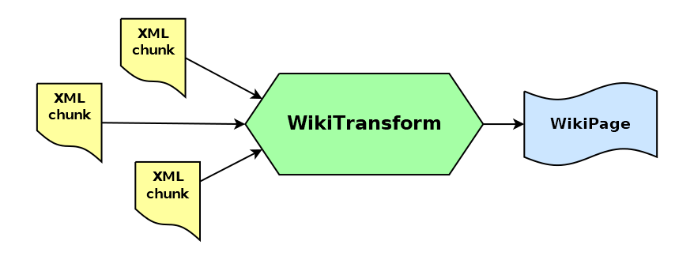

# wiki-transform

_Stream transforming raw XML into wiki pages_


[](https://badge.fury.io/js/@giancosta86%2Fwiki-transform)
[](/LICENSE)



**wiki-transform** provides a `WikiTransform` _hybrid stream_ for NodeJS: it takes _XML chunks_ and outputs `WikiPage` objects.

It is an extremely _fast_ stream, because it internally uses a **SAX** parser combined with a hyper-minimalist algorithm.

Last but not least, `WikiTransform` is a _standard_ stream, so you can use it in pipelines, or you can manually control it via the usual stream methods.

## Installation

```bash
npm install @giancosta86/wiki-transform
```

or

```bash
yarn add @giancosta86/wiki-transform
```

The public API entirely resides in the root package index, so you shouldn't reference specific modules.

## Usage

Just create a new instance of `WikiTransform` - maybe passing options. You will then be able to:

- add it to a _pipeline_ - via a chain of `.pipe()` method calls, or via the `pipeline()` function provided by NodeJS

- call its _standard methods_ - like `.write()`, `.end()`, `.on()` and `.once()`

### Supported format

`WikiTransform` will create a `WikiPage` object whenever it encounters the following XML pattern:

```xml
<page>
  <title>The title</title>
  <text>The text</text>
</page>
```

with the following rules:

- The order of the subfields is ignored

- _Additional subfields_ are ignored

- _Ancestor nodes_ are ignored

- _Whitespace_ is ignored

- _XML entities_ like `&gt;` are substituted with their actual characters

- _CDATA blocks_ within significant fields are correctly parsed, and can be freely mixed with non-CDATA text

### Example

This basic but fairly general-purpose function:

- extracts wiki pages from _any source stream_ actually generating XML chunks - for example, an HTTP connection, or a file

- outputs such `WikiPage` objects to the given target stream

```typescript
import { Readable, Writable } from "node:stream";
import { pipeline } from "node:stream/promises";
import { WikiTransform } from "@giancosta86/wiki-transform";

export async function extractWikiPages(
  source: Readable,
  target: Writable
): Promise<void> {
  const wikiTransform = new WikiTransform();

  return pipeline(source, wikiTransform, target);
}
```

### Constructor parameters

- **logger**: a `Logger` interface, as exported by [unified-logging](https://github.com/giancosta86/unified-logging). **Default**: no logger

- **highWaterMark**: if present, passed to the base constructor

- **signal**: if present, passed to the base constructor

## Additional notes

As a convenience utility, especially for testing, the package also provides a `wikiPageToXml()` function, which converts a WikiPage to XML - using a _CDATA block_ in every field.

## Further reference

For additional examples, please consult the unit tests in the source code repository.
